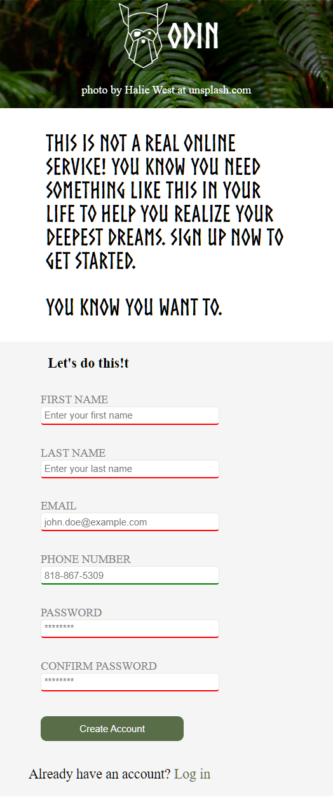

# Sign up form at The Odin Project

## Project: Sign up form
This repository contains an example project developed during my studies at [The Odin Project](https://www.theodinproject.com/). The project showcases various frontend development concepts such as HTML, CSS, Form, JavaScript, and responsive design techniques.

### screenshot large

### screenshot medium

### screenshot small

Follow this link for assignment <a href="https://www.theodinproject.com/lessons/node-path-intermediate-html-and-css-sign-up-form">Sign up form at The Odin Project</a>
